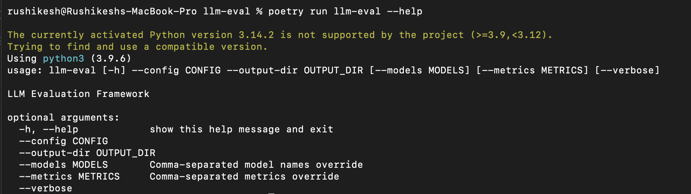
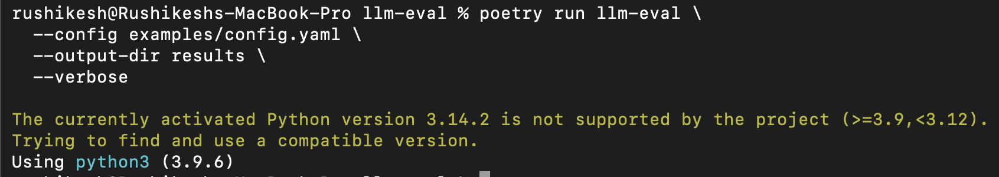

# LLM Evaluation Framework

## Overview

The **LLM Evaluation Framework** is a production-ready, CLI-driven Python framework designed to systematically evaluate Large Language Model (LLM) applications such as Retrieval-Augmented Generation (RAG) pipelines, chatbots, and question-answering systems. It provides automated, reproducible, and extensible evaluation across classical NLP metrics, RAG-specific quality metrics, and advanced LLM-as-a-Judge techniques.

This framework is built to address a real-world gap in LLM engineering: **reliable quality assurance and regression prevention for LLM outputs**. It is suitable for local experimentation, CI/CD pipelines, and production-grade evaluation workflows.

Key goals:
- Standardized evaluation across multiple models
- Reproducible results via configuration-driven runs
- CI/CD-friendly execution with non-zero failure signals
- Clear, human-readable and machine-readable reports

---

## Core Capabilities

- Classical NLP metrics: **BLEU, ROUGE-L, BERTScore**
- RAG-specific metrics: **Faithfulness, Context Relevancy, Answer Relevancy**
- **LLM-as-a-Judge** scoring with multi-dimensional rubrics
- Multi-model evaluation in a single run
- JSON and Markdown report generation
- Automated visualization generation (PNG plots)
- Docker and docker-compose support
- CI/CD-ready execution with GitHub Actions

---

## Installation

### Requirements

- Python **3.9 – 3.11**
- Poetry (recommended) or pip
- Docker (optional, for containerized runs)

---

### Installation using Poetry (Recommended)

```bash
git clone https://github.com/Rushikesh-5706/llm-eval-framework.git
cd llm-eval-framework
poetry install
```

Activate the environment:
```bash
poetry shell
```

---

### Installation using pip

```bash
git clone https://github.com/Rushikesh-5706/llm-eval-framework.git
cd llm-eval-framework
pip install -e .
```

---

## Quick Start

### Run Evaluation Locally

```bash
poetry run llm-eval   --config examples/config.yaml   --output-dir results   --verbose
```

After execution, verify outputs:

```bash
ls results
ls results/plots
```

Expected files:
- `results/results.json`
- `results/report.md`
- `results/plots/*.png`

---

### Run using Docker Compose (Recommended for Evaluation)

```bash
docker-compose up --build
```

Docker ensures a clean, reproducible environment suitable for evaluators and CI systems.

---

## Configuration System

The framework uses YAML or JSON configuration files.

Example: `examples/config.yaml`

```yaml
dataset_path: benchmarks/rag_benchmark.jsonl

models:
  model_a: examples/model_a_outputs.jsonl
  model_b: examples/model_b_outputs.jsonl

metrics:
  - bleu
  - rouge_l
  - bertscore
  - faithfulness
  - context_relevancy
  - answer_relevancy

judge:
  provider: openai
  model: gpt-4
  temperature: 0.0
  rubric:
    - coherence
    - relevance
    - safety
```

---

## Architecture Overview

High-level flow:

```
CLI → Config Loader → Dataset Loader → Metric Engine → Aggregator → Reports & Plots
```

### Key Components

- **CLI (`llm_eval.cli`)**  
  Entry point for running evaluations via command line.

- **Config System (`llm_eval.config`)**  
  Validates and loads YAML/JSON configs with early error detection.

- **Dataset Loader (`llm_eval.core.dataset`)**  
  Supports JSONL/CSV benchmark datasets.

- **Metrics (`llm_eval.metrics`, `llm_eval.rag`)**  
  Modular metric implementations with a shared base interface.

- **LLM-as-a-Judge (`llm_eval.judge`)**  
  API-based evaluator with retry and backoff logic.

- **Reporting (`llm_eval.reporting`)**  
  JSON and Markdown report generation.

- **Visualization (`llm_eval.visualization`)**  
  Histogram and radar chart generation (PNG).

A full design explanation is available in **ARCHITECTURE.md**.

---

## Evaluation Outputs

### JSON Report

- Machine-readable
- Per-example metric scores
- Aggregate statistics

File:
```
results/results.json
```

---

### Markdown Report

- Human-readable summary
- Tables and aggregate insights

File:
```
results/report.md
```

---

### Visualizations

Generated automatically as PNG files:

- Metric distribution histograms
- Radar chart comparing aggregate scores

Directory:
```
results/plots/
```

---

## Screenshots (CLI & Outputs)

Screenshots are stored in the `screenshots/` directory and rendered automatically by GitHub.

Recommended screenshots:
- CLI execution (`llm-eval --help`)
- Successful evaluation run
- Generated plots directory

Example:
```markdown
#### CLI Interface


#### Successful Evaluation

```

---

## CI/CD Integration

This repository includes a GitHub Actions workflow:

```
.github/workflows/evaluation.yml
```

On every push or PR, it:
- Installs dependencies
- Runs tests with coverage
- Executes evaluation
- Fails the build on errors

This enables automated quality gates for LLM systems.

---

## Testing

Run tests locally:

```bash
poetry run pytest tests/ --cov=llm_eval
```

Coverage target:
- **≥ 80%** for core modules

Includes:
- Unit tests for metrics
- Integration tests for CLI and pipeline

---

## Docker Image

Prebuilt Docker image:

🔗 https://hub.docker.com/r/rushi5706/llm-eval

Run directly:

```bash
docker run --rm rushi5706/llm-eval:latest llm-eval --help
```

---

## Extensibility

- Add new metrics via the plugin system
- Extend judge rubrics without core changes
- Add new datasets with minimal configuration

---

## Video Demo (Optional)

A full screencast walkthrough can be linked here showing:
- Setup
- CLI execution
- Result interpretation

---

## Reproducibility Guarantee

Any evaluator can:

1. Clone the repository
2. Run `docker-compose up`
3. Execute evaluation
4. View reports and plots

All within **10 minutes**, without manual intervention.

---

## License

MIT License

---

## Author

Rushikesh Kunisetty  
Production-ready LLM evaluation framework for real-world AI systems.
